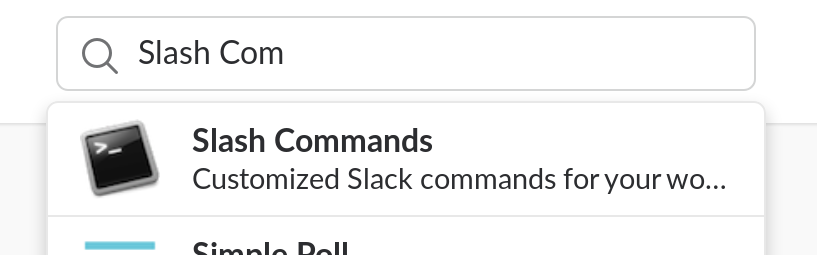

# Add Pokey the Penguin to Slack with webtask.io

[webtask.io](https://webtask.io/) is a powerful platform for creating and
using serverless [NodeJS](https://nodejs.org/)-based API endpoints. You can
write your code and use it live on the web within moments!

Due to its ease of use, it's a natural tool to integrate with
[Slack](https://slack.com/) via
[slash commands](https://api.slack.com/slash-commands), which allow you to
add a command that your teammates can type into Slack (like `/hello`) and
have that command send a request to a specific URL for processing.

[Pokey the Penguin](http://yellow5.com/pokey/) is a charming surrealist
webcomic that has been in existence for over 20 years. Recently, a
[simple search engine](http://yellow5.com/pokey/search/) was added that
allows you to find individual Pokey panels by keyword. I wrote
[a JavaScript module](https://github.com/rfreebern/pokey-api-js) that uses
this search and returns results via web scraping. This repository
uses the code from that module slightly modified to run as a webtask.

## Create your own Pokey webtask

_Note: this guide assumes you have some familiarity with development tools
including [NodeJS](https://nodejs.org/), [npm](https://www.npmjs.com/), and
[git](https://git-scm.com/), as well as administrator privileges in a
[Slack](https://slack.com/) workspace._

First, let's get set up to use webtask.io from the command line. In a terminal,
run `npm install -g wt-cli`. When that completes, run `wt init` to create your
webtask profile. You'll need to log in via your browser to complete this step.

Once that's done, the next step is to create your Pokey webtask. To do that,
you need to get your own copy of this code by running `git clone
git@github.com:rfreebern/pokey-webtask.git`.

When the clone finishes, `cd pokey-webtask` and then `wt create pokey.js` to
upload the code and create the endpoint. The result will be a new, custom URL
where you can try out the code. If you open this URL in your browser, you'll
see a response like the following:

```
{
  "code": 400,
  "error": "Script returned an error.",
  "details": "You must provide a \"text\" querystring parameter."
}
```

If you add a querystring like `?text=cookie`, you'll get a response with genuine
Pokey content:

```
{
  "response_type": "in_channel",
  "attachments": [
    {
      "fallback": "GUSTAVO: COOKIE!",
      "title": "CORPUS CHRISTI",
      "title_link": "http://www.yellow5.com/pokey/archive/index444.html",
      "image_url": "http://www.yellow5.com/pokey/archive/pokey444_4.gif"
    }
  ]
}
```

You can learn more about the format of this JSON from [the Slack API
for Messages](https://api.slack.com/docs/messages). If you decide to
modify your webtask's code, you can upload your changes by running
`wt update pokey pokey.js`.

### Set up the slash command in Slack

Slash commands are considered a "Custom Integration" in Slack. From your
Slack workspace's "Administration" menu, select "Manage apps". Once there,
type "slash commands" into the search box at the top of the page, and
choose the "Slash Commands" integration from the list.



Click "Add Configuration" to create a new slash command for your workspace.
Specify the command `/pokey`, provide the URL to your webtask endpoint, and
set the "Method" to "GET". The rest of the configuration can be set up any
way you please. I recommend naming the integration "Pokey", and finding a
good [Pokey icon](https://www.google.com/search?q=pokey+the+penguin&tbm=isch).

Save the configuration, and you're ready to go. In one of your channels, try
typing `/pokey hat`.


