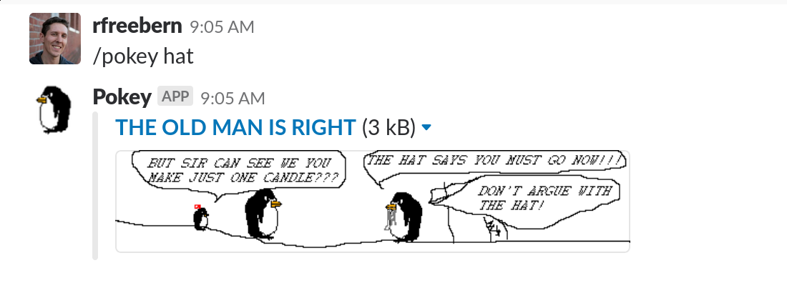

# Pokey the Penguin Slack Integration

Add [Pokey the Penguin](http://yellow5.com/pokey/) to your Slack! This uses
[webtask.io](https://webtask.io/) and code shamelessly pulled from
[my JavaScript Pokey API module](https://github.com/rfreebern/pokey-api-js)
to provide randomized Pokey search by keyword as a slash command in a Slack
workspace.

## Setup

### 1. Create the webtask endpoint

1. `git clone git@github.com:rfreebern/pokey-webtask.git` to your local machine.
2. `cd pokey-webtask`
3. `npm i -g wt-cli` to install the webtask CLI tools globally.
4. `wt create pokey.js` to create the endpoint.
5. Copy the URL provided.

### 2. Set up the slash command

1. In a Slack workspace where you have administrative privileges, navigate to `/apps/manage/custom-integrations`.
2. Search for "slash commands", click on it, and add it to the workspace.
3. Add a configuration with the command `/pokey`, the webtask URL from before, the method set to `GET`, and whatever additional customization you desire.
4. Save it, and then in your workspace, try `/pokey whiskey`.

## Example

